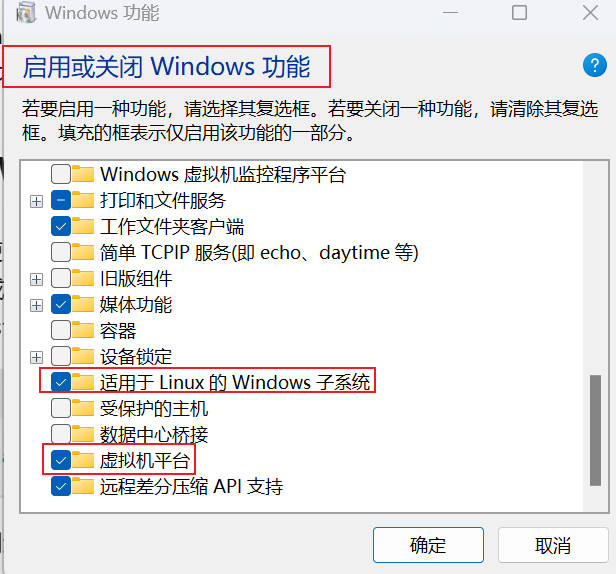
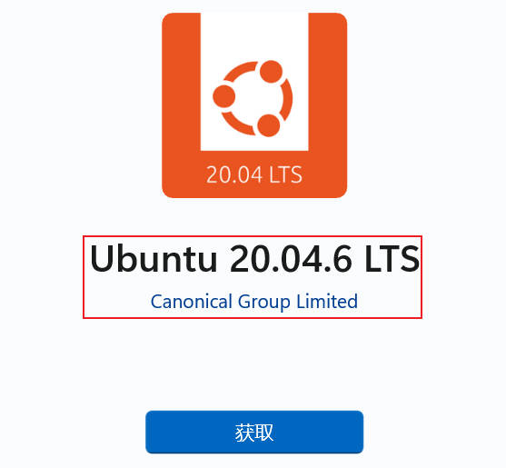
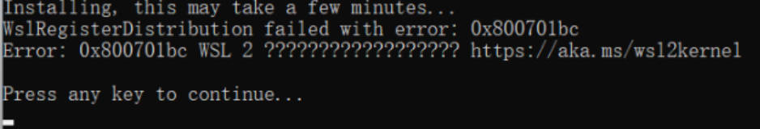
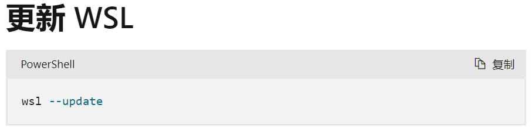
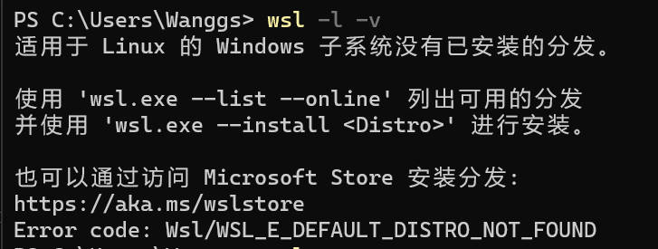
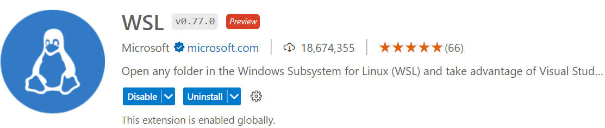
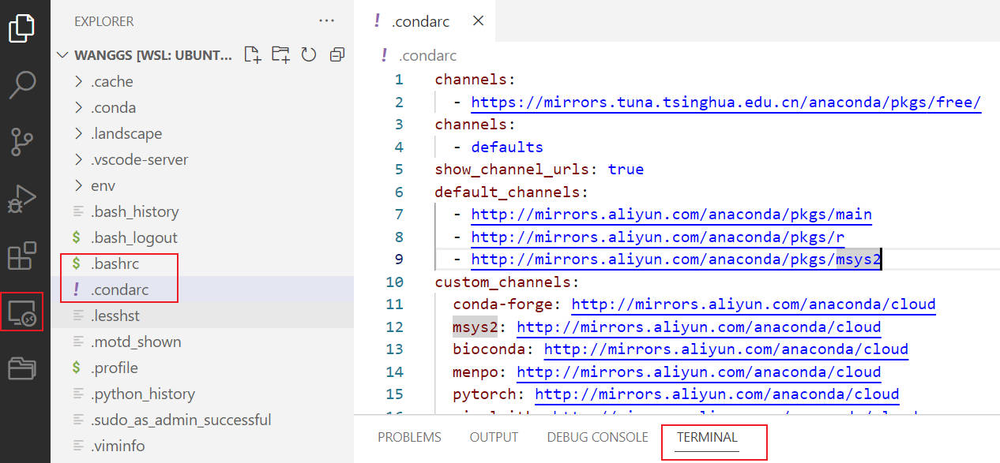
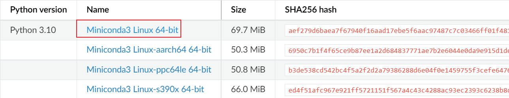
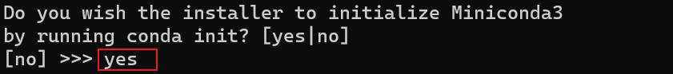

# Windows Subsystem for Linux

适用于 Linux 的 Windows 字系统：

[微软官方文档](https://learn.microsoft.com/zh-cn/windows/wsl/)

## 1.安装

**1.搜索打开：启用或关闭 Windows 功能**



选择上述两项，并进行重新启动。

**2.打开微软商店下载 Linux 发行版**


**输入 WSL，并选择版本**



**3.错误提示解决方法**

**错误1**



对 wsl 进行更新即可：`wsl --update`，然后重启。



**错误2**

[参考文章](https://zhuanlan.zhihu.com/p/612154391)

若提示没有已安装的分发，需点击 `Ubuntu` 进行安装即可。



## 2.使用

### 2.1 wsl+vsCode

输入：`wsl` 搜索拓展



### 2.2 Gym 配置

[参考教程](https://cloud.tencent.com/developer/article/1835263)

[Linux 环境按安装 Gym](https://www.jianshu.com/p/536d300a397e)

OpenAI Gym 是一个用于开发和比较 RL（Reinforcement Learning（强化学习））算法的工具包，它包括一系列不断增长、完善的环境，还提供可以用于比较和评估算法的平台。

在 Gym 中你可以上传你自己训练环境的算法上去，也可以看到别人上传的算法，并且可以下载别人的算法代码。

**前期安装 OpenAI/gym 的依赖**

```bash
sudo apt-get install -y python-numpy python-dev cmake zlib1g-dev libjpeg-dev xvfb ffmpeg xorg-dev python-opengl libboost-all-dev libsdl2-dev swig
```

#### 1.安装 miniconda

**建议切换到 VSCode 界面操作!!!**




[miniconda 官网](https://docs.conda.io/en/latest/miniconda.html#)



**建议直接使用默认的用户安装目录！！！**

```bash
#下载
sudo wget https://repo.anaconda.com/miniconda/Miniconda3-py310_23.3.1-0-Linux-x86_64.sh
#安装
sudo bash Miniconda3-py37_4.12.0-Linux-x86_64.sh
```




**更改安装路径的情况(不推荐)**

```bash
#下载
sudo wget https://repo.anaconda.com/miniconda/Miniconda3-py310_23.3.1-0-Linux-x86_64.sh
#安装
sudo bash Miniconda3-py37_4.12.0-Linux-x86_64.sh
#空格键翻页
#/opt/miniconda3
/usr/local/miniconda3
#/usr/local/src 是用户级的源码存放目录，(usr: unix system resource)

#手动配置安装路径
export PATH=/usr/local/miniconda3/bin:$PATH
#wq保存退出
source ~/.bashrc #重新载入文件
```

#### 2.更换阿里源

[阿里云镜像](https://developer.aliyun.com/mirror/anaconda?spm=a2c6h.13651102.0.0.5bfd1b11c4pvr9)

```bash
conda config --show-sources #查看源
conda config --remove-key channels #恢复默认源
conda config --remove channels defaults #删除默认源
```

#### 3.创建虚拟环境

重启电脑命令：`sudo reboot`

```bash
conda create -p E:\pythonwork\Jupyter\tensorflowenv38 python=3.8 
# 正式创建方法
conda create -n tfenv38 python=3.8
#激活
conda activate tfenv38
#退出
conda deactivate
conda remove --name <env name> --all
```

#### 4.安装 Gym

[Gym 历史说明](https://it.cha138.com/javascript/show-1976535.html)

[官方文档](https://gymnasium.farama.org/) || [Github 地址](https://github.com/Farama-Foundation/Gymnasium)

2021年接口从 gym 库变成了 gymnasium 库。但是，不管如何变，gym[nasium] 作为强化学习的代理库的总的设计思想没有变化，变的都是接口的细节总体来说。

对于gymnasium我们只需要做两件事情：一个是初始化环境，另一个就是通过 step 函数不停地给环境做输入，然后观察对应的结果。

```bash
pip install "gymnasium[all]"  #安装所有的依赖
pip install --upgrade "gymnasium[atari]"
pip install gymnasium[classic-control]
```

#### 5.测试案例

```bash
import gymnasium as gym
```


