# Linux Command Line

## 1.Shell

Shell 接受键盘输入的命令，将其传入到 OS 中执行。一般提到的命令行就是 Shell，Linux 发行版提供了来自 GNU 项目的 Shell 程序 Bash。Bash 是 sh(UNIX Shell) 的增强版。

### 1.1目录解读

- `/usr/share/doc`: 系统中安装的软件的文档文件。


### 1.2概述

提示符：`#` 表示具有超级用户 (root) 权限，一般情况下为 `$`。

查看磁盘当前可用空间：`df`

查看内存容量：`free`

终止终端：`exit` 或 `ctrl+d`

#### 文件树

在类 UNIX 系统中，只有一个文件系统树，按照设置，存储设备会**挂载**在文件系统树的不同位置。

**pwd:** 显示当前目录，即 print working directory，每个普通用户都有自己的主目录，该**主目录也是普通用户唯一有权限写入文件的地方。**

**ls:** 列出当前工作目录中的文件和子目录

```bash
ls --help
# 使用长格式命令
ls -l 
ls -lt --reverse
```


**cd:**  更改当前目录，如更改到程序安装的目录中：`cd /usr/bin`。`.` 表示当前目录，`..` 表示上一级目录，

大多数情况下，可以忽略 `./` 。

一些便捷写法：


**文件名说明**

在 Linux 中万物皆文件 (Everything is a file)，不要求文件名必须反映文件内容，如 `.jpg` 文件未必就是图像。

- 以 `.` 开头的文件是隐藏的，使用 `ls -a` 才可以查看
- 建议使用下划线 `_` 而不是空格，避免不必要的麻烦
- 没有文件拓展名，即不根据文件拓展名决定文件的内容和用途

#### 选项和参数

```bash
command -option arguments
```

单个连字符：短选项，可合并在一起使用

两个连字符：长选项

**文件字段解读**

10 个字符，第一个指明文件的类型，其余皆表明相应的文件访问权限。


**file:** 确定文件类型，输出对文件的简要描述。

**less:** 使用 less 命令查看文本文件，`less \etc\passwd`

#### 符号链接和硬链接

符号链接也称作软链接。


### 1.3操作文件和目录

#### 常用命令

- mkdir：创建目录
- cp：复制文件和目录
- mv：移动和重命名文件和目录
- rm：删除文件和目录
- ln：创建符号链接和硬链接

#### 通配符

通配符 (wildcard)：用于帮助快速指定一组文件名的一种特殊字符。

使用通配符的过程称为，通配符匹配 (globbing)。

`[A-Z]` 或 `[a-z]` 属于传统的写法，现在使用字符类代替这种写法。

匹配隐藏文件：`.[!.]*`


#### 详解介绍

**mkdir**

```bash
mkdir dir1, dir2, dir3
```

**cp**

与 mv 的用法类似，未指明选项的，会默认覆盖同名文件。


```bash
# 将 item1 复制到 item2
cp item1 item2
```

**mv**


**rm**

删除一个或多个文件和目录

`rm -r directory`: 删除文件夹


**ln**

创建硬链接和符号链接。

```bash
#硬链接，不能为目录创建
ln file link
#符号链接，文件或目录
ln -s item link
```

**硬链接**：默认情况每个文件只有一个，存在两个重要限制：

- 不能引用目录
- 文件与链接不在同一磁盘分区则无法引用该文件


**4** 表示当前的硬链接数量，**文件至少一个硬链接，因为文件名就是一个硬链接**。

但由于硬链接无法直接显示出，具体分辨可以用：`ls -il` 查看文件节点号，节点号对应磁盘上存储数据的位置，最终也可以看出二者是同一个文件。


**符号链接**：与 Windows 的快捷方式类似，不过早于快捷方式，用于克服硬链接缺陷。

```bash
ln -s fun fun-soft
ln -s ../fun dir1/fun-soft
#为目录创建
ln -s dir1 dir1-sym
```


### 1.4深入理解命令

#### 帮助和识别命令

命令的种类：

- 可执行程序
- 在 Shell 中的内建命令
- Shell 函数
- 别名，自定义命令

#### 详细介绍

**type**

确定命令的类型，需要注意的是，**ls 实际上是添加了 --color=tty 选项命令的别名 (aliased)，所以输出结果是彩色的。**


**which**

显示**可执行文件**的位置

**help**

获取帮助文档

```bash
#适用于所有的Shell内建命令
help cd 
mkdir --help
```

**man**

大多数命令行程序会提供一份叫做手册 (manual) 或手册页 (man page) 的正式文档。

一般包含以下的内容：

- 标题
- 命令语法提要
- 命令作用描述
- 命令选项清单及描述

```bash
man ls
man 5 passwd #显示指定的节
man -k list #使用关键字粗糙搜索，与 apropos list 类似
```


```bash
whatis ls #显示手册的简介
```

#### alias 创建自己的命令

可以使用分隔符 `;` ，一行输入多个命令。

```bash
type foo # 命名前最好检查下名称是否被占用
alias foo='cd /usr; ls; cd -'
type foo # 命名完使用 type 查看别名
unalias foo # 删除别名

# 列出所有的别名
alias
```

需要注意的是：当 Shell 会话结束时，别名会随着消失，为了避免可添加到**系统环境初始化文件**中。

### 1.3重定向

- cat : 拼接文件
- sort: 排序文本行
- uniq: 报告或忽略重复的行
- wc: 统计文件中换行符，单词以及字节的数量
- grep: 输出与模式匹配的行
- head: 输出文件的开头部分
- tail: 输出结尾部分
- tee: 读取标准输入并将输出结果写入标准输出和文件

#### 标准输入/出

程序可能产生的结果

- 运行的结果
- 运行的状态和错误信息

实际上，程序将结果和状态消息分别发送到了名为：

`stdout` (标准输出，standard ouput) 

`stdeer` (标准错误，standard error) 的特殊文件

默认情况下，标准输出和标准错误与显示器屏幕相关联，**不会保存为磁盘文件。**

`stdin` : 程序从中获取输入信息，**重定向则允许我们修改输出结果的去处和来源**。

#### 输出重定向

将输出重定向到其他文件中，而不是默认的屏幕上，**通常是将命令的输出结果保存到文件中去。**

```bash
# 可截断某个文件或创建一个新文件
> filename.txt

# >> 重定向操作符,文件存在则追加，不存在则新建
ls -l /usr/bin >> file_name.txt
```

#### 标准错误重定向

Shell 内部用文件描述符引用标准输入/出和错误：

- 标准输入：文件描述符— 0
- 标准输出：文件描述符— 1
- 标准错误：文件描述符— 2

```bash
# 使用文件描述符进行重定向写法
ls -l /bin/usr 2> demo.txt # 标准错误重定向
```

**输出和错误在同一文件**

传统方式：

```bash
# 执行两次重定向，标准输出重定向到 demo.txt，再将描述符 2 重定向到描述符1
ls -l /bin/usr > demo.txt 2>&1
```

较新版本的 bash:
```bash
ls -l /bin/usr &> demo.txt
ls -l /bin/usr &>> demo.txt #追加
```

**丢弃不必要的命令**

将输出重定向到 `/dev/null` 的特殊文件，该文件是一个系统设备，通常称为位桶 (bit bucket)。

```bash
ls -l /bin/usr 2> /dev/null
```

#### 标准输入重定向

cat: 用于读取一个或多个文件并将其复制到标准输出，**不分页**显示文件内容，常用于较短的文件。

```bash
cat demo.txt
cat moive.mpeg.0* > movie.mpeg #多个短文件进行合并
```

**输入**

仅用 `cat` 命令，无任何参数，此时等待输入，再按 enter 键，最后按 `ctrl+D` (End Of File，EOF) 结束输入。

```bash
cat > demo.txt # 件输入保存到一个文件中，使用少量文本
cat demo.tx # 查看结果，将 demo.txt 复制到标准输出
cat < input_files.txt #将输入定向到一个文件
```

#### 管道

操作符 `|`，Shell 的管道特性：可以将一个命令的标准输出传给另一个命令的标准输入。

```bash
#将输出结果排序合并并分页显示
ls -l /bin /usr/bin | sort | less
```

报告或忽略重复行—uniq

```bash
# 保证输出结果没有重复行
ls -l /bin /usr/bin | sort | uniq | less
ls -l /bin /usr/bin | sort | uniq -d| less #d选项显示有哪些重复行
```

统计单词，字节和换行符的数量—wc

```bash
#wc (word count) 单词统计
wc demo.txt
ls -l /bin /usr/bin | sort | uniq | wc -l # l选项表示只输出文件行数
```


**grep-输出与模式匹配的行**

用于查找文件的的指定文本

grep -i : 命令搜索时忽略大小写

grep -v: 只输出不匹配的行

```bash
# 从程序列表中找出名称中包含单词 zip 的所有文件
ls -l /bin /usr/bin | sort | uniq | grep zip
```

输入开头 head 和结尾 tail (前 10 行和后 10 行)

```bash
head -n 15 demo.txt #n 表示输出15行
ls /usr/bin | tail -n 5

#注意的是tail有一个tail选项可动态查看
tail -f demo.txt
```

tee: 管道中的 T 形头，读取输入并将结果写入到文件。

```bash
ls -l /bin /usr/bin | sort | uniq | |tee demT.txt | grep zip
```

### 1.4Shell特性

#### 扩展

```bash
echo .[!.]*
ls -A #显示出隐藏的文件
# 波浪线扩展到主目录
echo ~

# 算数扩展
echo $((expression))

# 花括号扩展
echo {Z..A}
mkdir {2007..2009}-{01..12}

#命令替换,可以在无须知道完整路径的情况下获得cp命令的详细信息
ls -l $(which cp)
```

#### 引用

双引号：阻止单词分割

```bash
ls -l "two words.txt"
```

参数扩展，算数扩展，命令扩展仍然可以使用：

```bash
echo "$USER $(2+2) $cal"
echo "$(cal)" #echo $(cal) 的区别
```

**禁止所有的扩展，需要使用单引号**

```bash
# 转义字符，在双引号中使用选择性避免扩展
echo "The $USER is: \$5.00"
```

### 1.5键盘技巧

#### 编辑命令行

Bash 使用一个名为 Readline 的库来实现命令行编辑。

Readline 文档使用术语 `killing` 和 `yanking` 分别指剪切和粘贴被剪切的文本保存在名为 `kill-ring` 的缓冲区内。

辅助键：`meta key`

补全键：两次 `Tab` 显示所有可能的结果

`Ctrl+K`: 当前行到行尾剪切；

`Ctrl+A`: 移动到开头

`Ctrl+E`: 移动到结尾


#### 搜索历史记录

动态增量搜索方式：

`Ctrl+R`，然后输入要搜索的内容；找到后按 `Ctrl+J` 复制到当前行。


**历史命令拓展**

`!+数字` 可以插入某条历史记录。


### 1.6权限-重点

- id 查看用户身份
- chmod 修改文件模式
- umask 设置默认权限
- sudo 以其他用户身份执行命令
- su 以其他用户身份启动 Shell
- chown 更改文件属主和属组
- chgrp 更改文件属组
- passwd 修改密码

#### 属主，属组和其他

可用 id 查看用户的身份信息。

`uid`: 用户 id ，映射用户名；`gid` : 属组 id

现在 Linux 的做法是为每个用户创建一个和用户同名的**单成员属组**。

#### 读取，写入和执行

第一字符表示的是

剩下的 9 个字符是文件模式，代表文件属主，文件属组，其他用户的读取，写入，执行权限。


#### 修改权限

前提：**文件属主或超级用户**，**修改文件或目录的模式**

两种截然不同的模式表示方法：

- 八进制表示法

  (octal，八进制)，十六进制 (hexadecimal，十六进制)

  ```bash
  chmod 600 foo.txt
  ```

  

- 符号表示法

  改动的对象：u 文件或目录的属主；g 属组；o 其他用户；a 即所有

  执行的操作：+ 添加权限；- 除去权限；= 赋予指定的权限，同时去除其他所有的权限。

  设置的权限

  

**掩码值**

`umask` 一般不更改，掩码二进制中出现 1 的地方对应位置权限去除。

```bash
umask 0000 # 相当于关闭掩码
umask 0022 # 设置掩码值
```

#### 改变用户身份

`su` 以其他用户身份启动，如 `su [-[l]] [user]`，设置 `-l` 或省略为 `-` 形式，表示启动的 Shell 会话作为指定用户登录 Shell。意味着会加载用户环境并将工作目录更改为该用户的主目录。

```bash
# 未指明用户名的，假设以超级用户启动
su -
exit #退出
```

`sudo`

无需输入 root 密码，只需输入自己的密码即可。

`sudo` 不需要启动新 Shell ，也不用加载其他的用户环境。

#### chown 更改文件属主和属组

需要超级用户权限：

```bash
sudo cp myfile.txt ~tony #~表示主目录，即当前用户的用户主目录
sudo ls -l ~tony/myfile.txt
sudo chown tony: ~tony/myfile.txt #更改属主
sudo ls -l ~tony/myfile.txt
```


旧版本中还有 `chgrp` 表示只能更改文件属组

### 1.7进程

#### 进程工作方式

系统启动时，内核运行 init 程序，init 再依次启动一系列初始化脚本 (位于/etc)。

**一个程序能够启动其他程序，即父进程生成子进程。**

#### 查看进程 

**`ps`**

`ps` 选项众多，默认只输出与当前终端会话关联的进程信息，TTY (teletype，电传打字机)。


`ps x` 显示所有的进程 (注意无连字符)，TTY 中的 ？表示没有控制终端。

`ps axu` 输出更多进程信息。


**`top`** 

**动态**查看进程，默认每 3s 更新一次系统进程列表。按 `q` 退出，`h` 查看帮助

类似与 Windows 的任务管理器，但 top 的资源消耗更少。


#### 进程控制

**直接中断：**`Ctrl+C`  **暂停：**`Ctrl+z`

**进程置于后台**：

- `gedit &`，命令后面加上 `&` ,`Shell` 会生成指定编号的作业。
- ps 查看
- jobs 查看作业
- fg %1 切换回前台，%1 是作业的编号


#### 信号-kill

kill PID/作业参数，kill 命令并不是杀死进程，而是向其发送信号。


`Ctrl+c` 则是发送 INT 信号；`Ctrl+z` 则是发送 TSTP 信号。

可通过编号或者名称 (包含带有 SIG 的名称)，


kill -l  显示所有的信号：


向多个进程发送信号：killall gedit

#### 关闭进程

可以不加任何参数的：`sudo reboot`

- halt
- poweroff
- reboot

挂起系统：**sudo shutdown -h now**

关机：**sudo shutdown -r now**


## 2.配置与环境

### 2.1环境

利用环境自定义 Shell，Shell 环境中保存了两种基本类型数据：环境变量和 Shell 变量。但在 Bash 中则基本没有区别，Bash 将一部分数据存放在 Shell 变量中，其他数据存放在环境变量中。

#### 检查环境

set | less : 显示 Shell 变量和环境变量，结果会按字母排序

printenv | less : 显示环境变量，命令较长，建议通过管道传给 less

echo $HOME 可以查看变量的内容

注意：环境中的别名无法使用 set 命令和 printenv 命令显示，查看别名，可以使用不带参数的 alias 命令。

**变量名解读**


#### 修改环境

用户登录=>启动文件的配置脚本=>读取主目录中定义个人环境的多个启动文件

`PATH=$PATH:$HOME/bin`，修改 PATH 变量，将其放入最后面。


了解到启动文件的位置后，可以自定义环境：

在 PATH 变量中添加目录或定义额外的环境变量，Ubuntu 使用的是 `.proflie`。

**编辑器**

备份：`cp -i .bashrc .bashrc.bak`，未设置选项 i 的话，cp 命令默认**无提示覆盖**同名的文件夹。


GNOME 自带的图像化编辑器 gedit。

Nano 编辑器目的在于替代**电子邮件客户端自带的文本编辑器**，功能有限。

退出：`Ctrl+x`；保存已完成的工作：`Ctrl+o`

**使得改动的文件生效**

一般更改只有再次启动时才会生效，也可以强制生效：`source ~/.bashrc`

### 2.2 vi

Vim 是 Vi 的增强版，即 Vi Imporoved。Vi 的首个版本由 Bill Joy 于 1976 年编写，取名自单词 Visual。


#### 替换操作

`:%s /line /Line /gc` ，c 表示替换时进行确认。


#### 文件切换

:bn 切换到下一个文件，buffer next

:bp 切换到上一个文件，buffer previous

:buffers 查看被编辑的文件，:buffers 2 切换到指定的缓冲区编号

:vim foo.txt  打开多个文件；:e demo.txt；此时第一个文件依然存在

```bash
# 将文件的内容复制到另一个文件
:buffer 1 #切换到 1 号缓冲区
:buffer 2

# 移动到指定的位置，将光标下插入指定的文件
:r foo.txt

# 退出操作
:w demo.txt
:wq # 退出并保存
```

### 2.3 定制提示符

提示符由环境变量 PS1 定义：

```bash
echo $PS1 # 查看
psl_old = "$PS1" # 背份原来提示符
PS1 = "\$" # 重新设置提示符形式
PS1 = "$psl_old"

```

## 3.常见任务和必备工具

### 3.1软件包管理

早期的 Linux 安装需要下载并编译源码，使得可以检查和改进。而预先编译号的软件包会更快更容易。目前 Linux 发行版采用的打包系统主要分为两种：`.deb` 或 `.rpm`。

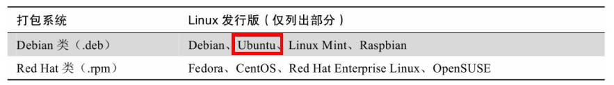

软件包文件是打包系统的基本软件单元，即经过压缩后的文件集合。目前大多数软件包由发行商和第三方制作。

Linux 发行版针对软件开发周期的各个阶段维护不同的仓库：

- 测试仓库—包含刚创建的软件包
- 开发仓库—尚在开发过程中的软件包

打包系统的组成：

- 处理**包文件的安装和删除**等任务的工具
- **执行元数据搜索和解决依赖性问题**的高层工具

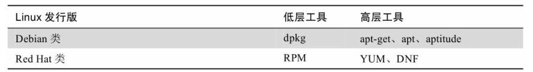

### 3.2常见的软件包管理任务

使用高级工具从仓库中下载，可解决依赖问题。

不是从仓库中下载，可以直接使用低层工具安装，但无法解决依赖问题。

`dpkg`: Debian Packager

`rmp`: The RPM Package Manager

```bash
# 高层工具从仓库中下载并安装软件包
yum search emacs
#Debian 系列
apt-get update
apt-get install package_name

# 低层工具直接安装，但无法解决依赖问题
dpkg-i package_file
rmp-i package_file
```

**安装**

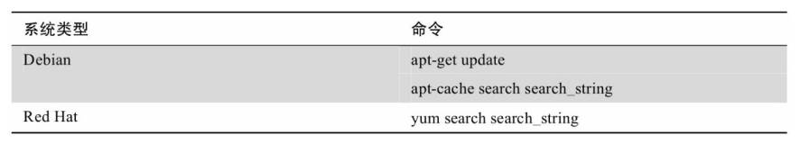

**删除**

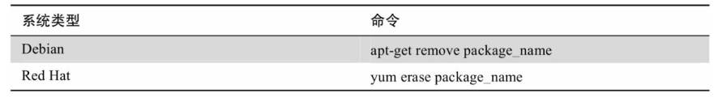

**更新**

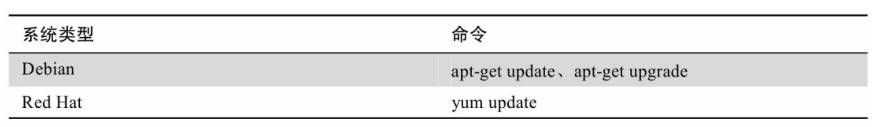

列举出安装的软件包：

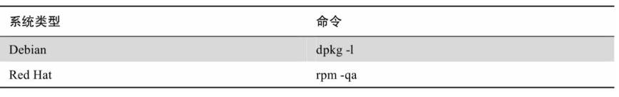

```bash
dpkg -l | less
# 识别文件是那个软件包安装的
dpkg -S file_name
rmp -qf file_name
```

### 3.3存储介质

独立磁盘冗余阵列 (Redundant Array of Independent Disks，RAID)

逻辑卷管理器 (Logical Volume Manager，LVM)

#### 存储设备的挂载和卸载

管理存储设备：

**1.挂载：**将设备挂接 (attaching) 到文件系统，

查看：/etc/fstab (文件系统，file system table) 的缩写，列出在系统引导时挂载的各种设备 (通常为硬盘分区)。

`ext4`: 第 4 代扩展文件系统 (Fourth Extended File System，ext4)


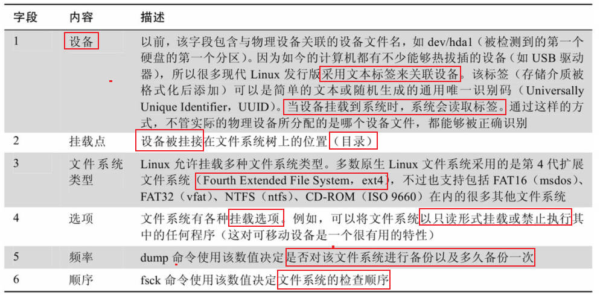

挂载命令：mount，不带任何参数时，可显示当前已挂载的文件系统列表。

`mount` 查看：

表头：`device on mount_point type filesystem_type (options)`

**设备 on 挂载位置 type 文件类型 挂载形式为读取和写入 (rw)**


```bash
su -
umount /dev/sdc # 卸载
mkdir /mnt/cdrom
# 创建目录并指定为新的挂载点，-t 用于指定文件系统类型
mount -t iso9660 /dev/sdc /mnt/cdrom
```

#### 确定设备名称

```bash
ls /dev
# 实时查看可移动设备接入系统的名称
sudo tail -f /var/log/messages # var/log/syslog

# 确定设备名称后挂载闪存驱动器
sudo mkdir /mnt/flash
sudo mount /dev/sdb1 /mnt/flash
```

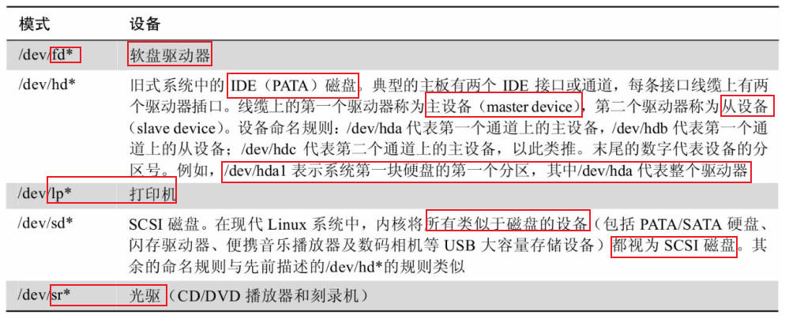

#### 文件系统

将原来的 FAT32 文件系统用 Linux 文件系统格式化为 ext4，使用 fdisk 可以编辑，删除，创建驱动器分区。

```bash
sudo umount /dev/sdb1
m # 显示程序菜单
p # 显示磁盘分区
# 使用 make filesystem 创建指定格式的文件系统，-t 选项指定 ext4 类型
sudo mkfs -t ext4 /dev/sdb1
# 重新格式化为 FAT32 文件系统
sudo mkfs -t vfat /dev/sdb1
```

**修复和检查**

系统每次启动时，挂载文件系统之前会检查文件系统的完整性，由 fsck (filesystem check) 完成。fstab 文件每个条目末尾数字对应设备的检查优先级，0 表示不用例行检查，同时 fsck 也可用于文件修复。

```bash
# 检查闪存驱动器(先将其卸载)
sudo fsck /dev/sdb1 
```

#### 设备间直接移动数据

dd (data definition) 命令将数据块从一处复制到另一处

需要注意的是，dd 命令非常强大，也被称为 destory disk（在输错 if 和 of 内容的时候出现）。

```bash
dd if=input_file of=output_file [bs=block_size [count=blocks]]
# 将两个驱动器插入计算机
# 假设被分配的名称为 /dev/sdb 和 /dev/sdc
# 将其中一个驱动器的内容复制到另一个
dd if=/dev/sdb of=/dev/sdc
# 或将其复制成一个普通文件
dd if=/dev/sdb of=flash_drive.img
```

**操作 ISO 映像文件**

```bash
# genisoimage 创建包含目录的 ISO 映像文件
# 在用户目录下创建 cd-rom-files 文件夹
mkdir ~/cd-rom-files
# R 添加启用 Rock Ridge 扩展 (Rock Ridge extensions)的元数据，允许使用长文件名和 POSIX 风格的文件权限
# J 启用 Joliet 拓展的元数据，允许使用 Windows 长文件名
genisoimage -o cd-rom.iso -R -J ~/cd-rom-files
```

**直接挂载 ISO 映像文件**

检查 ISO 映像文件的完整性也是有必要的，常用的方法是：`md5sum`

```bash
# 检查 md5sum
md5sum image.iso
# 创建多级目录
mkdir -p mnt/iso_image
mount -t iso9660 -o loop image.iso mnt/iso_image
```

### 3.4联网

网络附加存储设备 (Network-Attached Storage，NAS)

统一资源标识符 (Uniform Resource Identifier，URI)

#### 网络检查和监控

**ping**

ping  验证网络的连通性。该命令向指定主机发送名为 ICMP ECHO_REQUEST 的特殊网络分组，接受到此分组的网络设备会回应。

ping 命令启动后，默认按照特定间隔 (1s) 持续发送分组，直至中断。一次成功执行的 ping 命令表明网络的各个组成部分—接口卡，线路，路由，网关良好。

```bash 
ping baidu.com
```

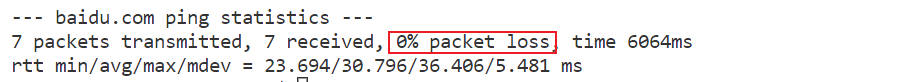

**traceroute**

也有系统使用 tracepath 代替，主要用于列出流量从本地系统到指定主机经过的所有跳数 (hop)。

```bash
traceroute baidu.com # 查看到达 baidu 的路由
```

在输出结果中从本地系统到目标网址需要 30 个路由器，对于提供标识信息的路由器，能够得知其主机名，IP 地址即性能数据。没有提供表示信息的路由器，则用星号表示。

如果路由器信息被阻塞，可以使用 traceroute 命令 -T 或 -l 选项解决。

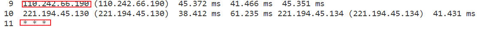

**ip**

ip 取代早期的 ifconfig 程序 (旧命令)，可以使**用 ip 检查系统的网络接口和路由表**。

第一个接口是环境接口 (lo，loopback interface)，虚拟接口，系统用来 talk to itself

第二接口是以太网接口 (eth0)，进行网络诊断，重要的是在每个网络接口信息的第 1 行中寻找 UP (表示接口已启用) 字样，并查看第 3 行的 inet 字段是否存在有效的 IP 地址。

如果系统采用动态主机配置协议 (Dynamic Host Configuration Protocol，DHCP)，有效的 IP 地址则能证明 DHCP 工作正常。

**netstat**

用于检查各种网络设置和统计信息：

```bash
netstat -ie # 检查系统的网络接口
netstat -r # 显示内核的网络路由表
```

#### 文件传输-wget

**ftp**

File Transfer Protocol，FTP。

**lftp**: 更好的 ftp

**wget**

命令行文件下载程序，用于从 Web 和 FTP 网站下载文件，单个文件，多个文件，甚至整个网站都没有问题。通过 wget 可以实现递归下载，后台下载，断点续传等。

```bash
# 下载网页
wget http://linuxcommand.org/index.php
```

#### 与远程主机安全通信

互联网普及之前，两个登录程序：`rlogin` 和 `telnet`，但所有的信息都是通过明文形式传输的。

**ssh**

secure shell，**ssh 协议解决了与远程主机进行安全通信的基本问题。**

- 认证远程主机的身份是否属实
- 加密本地主机与远程主机间的所有通信

SSH 由两部组成：

- SSH 服务器，在远程主机中运行，负责在端口 22 上监听接入的连接
- SSH 客户端，本地主机中运行，和远程 SSH 服务器通信

多数 Linux 发行版自带来自 OpenBSD 项目的 SSH 实现 openSSH，而 Ubuntu 仅提供客户端软件包，要让系统接受远程连接，需安装 OpenSSH-server 软件包，且允许 TCP 端口 22 接受接入的网络连接。

用于连接远程 SSH 服务器的 SSH 客户端程序称为 ssh，测试远程连接：

```bash
ssh localhost
```

使用单引号原因在于我们希望**不在本地主机上运行路径名拓展，而是在远程主机上运行。**

**scp 和 sftp**

OpenSSH 软件包有两个程序：

- scp (secure copy)：与 cp 差不多，差别在于要在 scp 命令的源路径或目的路径前加上远程主机名和冒号

  ```bash
  # 将远程主机的文件复制到本地主机的当前目录中
  scp remote-sys:document.txt .
  # 远程主机账号与本地账号不一致，需要加上主机名
  scp bob@remote-sys:document.txt .
  ```

- sftp，是 ftp 程序的安全版本，与 ftp 程序类似，不过传输时使用了 SSH 加密隧道。且 sftp 不需要远程主机运行 ftp 服务器，只需要 SSH 服务器就行。

  ```bash
  sftp remote-sys
  sftp>bye # 退出
  ```

Linux 发行版一般都支持 SSH 文件传输协议 (SSH File Transfer Protocol，SFTP)，都可以在地址栏中输入 `sftp://URI` 对存储在运行着 SSH 服务器上的远程主机上的文件进行操作。

说明：当使用一台安装有 Windows 系统的计算机需要登录 Linux 服务器完成一些实际的工作，则可以使用 Windows 版的 SSH 客户端。

### 3.5查找文件

**根据文件名查找**

简单文件查找方法：`locate`

`slocate` 和 `mlocate` 是现代 Linux 发行版中常见的两种变体，本质上还是通过符号链接 `loacte` 命令访问。

**复杂的文件查找方法**

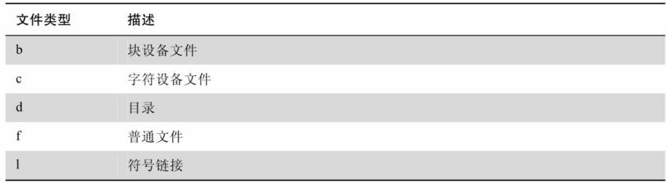

`find` 可以根据各种属性在指定目录中查找文件：

```bash
# 查找主目录的文件列表
find ~ | wc -l
# 加入测试条件，只查找目录 d
find ~ -tyep d | wc -l
# 加入测试条件，只查找普通文件
find ~ -tyep f | wc -l
# 查找格式为 JPG 且大小大于 1M 普通文件
find ~ -type f -name "*.JPG" -size +1M | wc -l
```

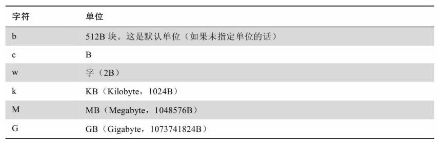

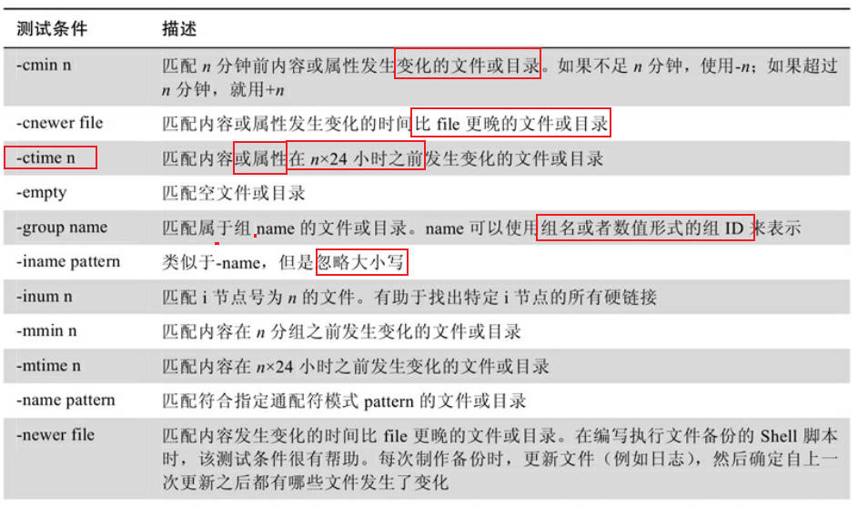

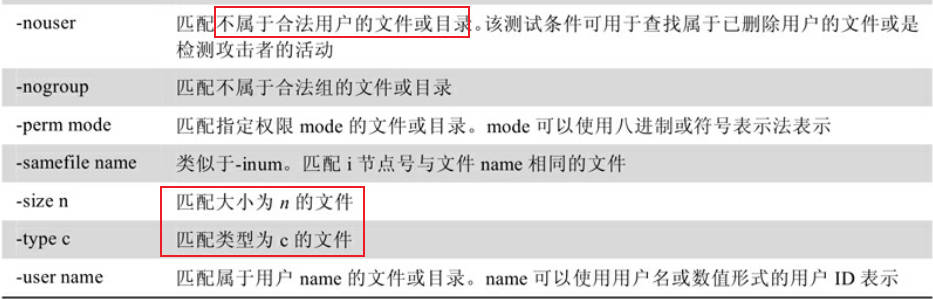


