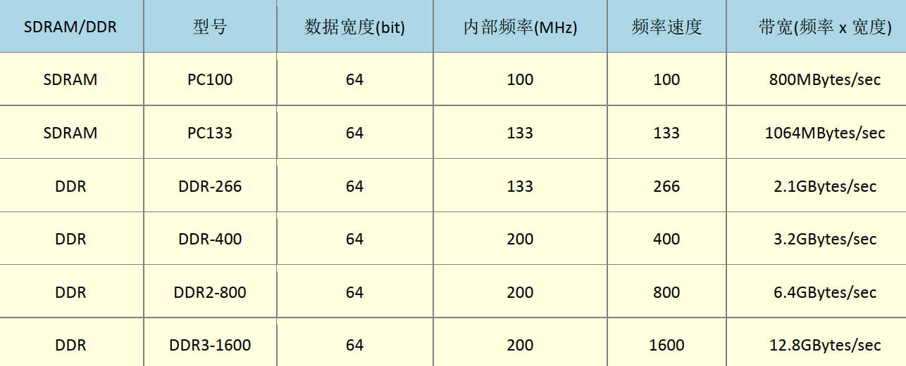
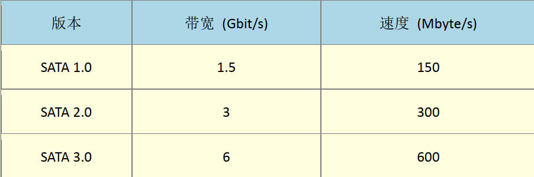
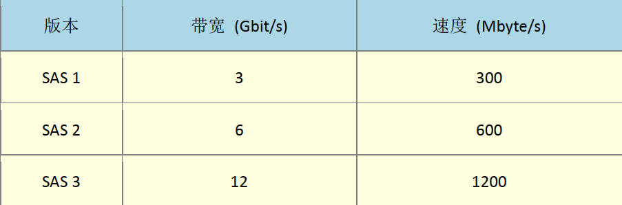
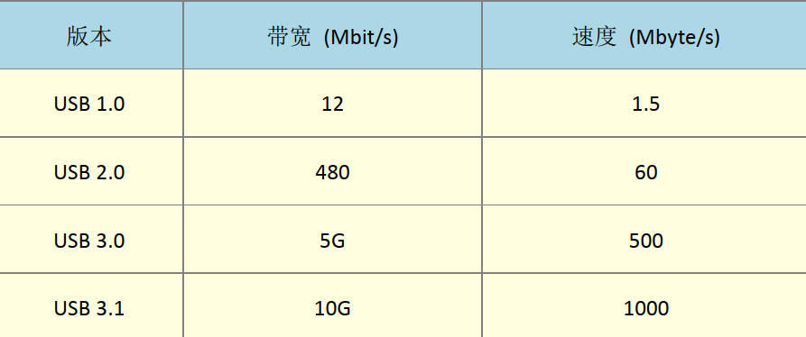
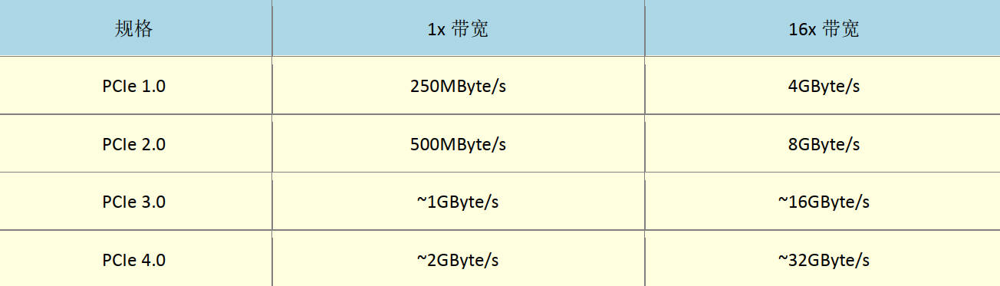

# Linux_intro
## 第 0 章 基础知识

### 0.1 计算机组成

计算机组成：输入单元、输出单元、控制单元、算术逻辑单元、主存储器

CPU：算术的逻辑单元和控制单元

- 算术的逻辑单元主要负责**程序运算**与**逻辑判断**
- 控制单元**协调周边组件与各单元**间的工作

### 0.2 CPU 架构

目前 CPU 具有两种指令集：精简指令集（RISC）与复杂指令集（CISC）。

**基于 RISC 设计的 CPU**

指令精简、运行时间短、执行效能高、复杂的事情需要多个指令完成。

Oracle 的 SPARC 系列：一般用于学术领域的大型工作站、金融体系的主服务器等。

IBM 的 Power Architecture 系列（包括 Power PC）：如 Sony 出产的 Play Station 3（PS3）使用 PowerPC 架构的 Cell 处理器。

ARM Holdings 的 **ARM CPU** 系列：各厂牌的手机、PDA、网络设备（路由器、交换器等）等，可以说是使用范围最广的 CPU 架构。

**基于 CISC 设计的 CPU**

指令的数目多且复杂，每条指令的长度也不相同。处理的工作丰富，但执行时间长。

主要有 AMD、Intel、VIA 等的 **×86 架构的 CPU**（因为最早由 Intel 发展的 CPU 代号为 8086）。

03 年时，Intel 开发的 ×86 架构 CPU 由 8 位升级到 16、32 位。其后 AMD 依次架构进一步修改 CPU 为 64 位，为了区别差异性， 64 位的个人计算机 CPU 统称为 **×86_64 架构**。

一般来说：文件容量使用的是二进制方式；速度单位则使用十进制模式。

**硬盘的容量问题**：500 GB 的硬盘格式化后剩下 460 GB 左右的容量：一般的硬盘制造商使用十进制单位制造，500 GByte = 500×1000×1000×1000 Byte，转换为二进制（1024），就成为 466 GB 左右的容量。因为硬盘的最小物理量为 512 Bytes，最小的组成单位为扇区（sector），而硬盘容量通常采用多少个 sector 来计算。

### 0.3 内存

主存储器主要组件为动态随机存取内存（Dynamic Random Access Memory，DRAM），通电时使用，断电后数据消失，也称为挥发性内存。

DRAM 分为 SDRAM 和 DDR SDRAM 两种，DDR（Double Data Rate）双倍数据传输速度，性能优于 SDRAM。后续又出来 DDR2（4 倍频率），DDR3（8 倍频率）等。

注意：DDR3L 标准电压低于 DDR3 ，用于耗电量低的笔记本中，根据主板规格进行选择。

**高速缓存**

静态随机存取内存（SRAM），容量小速度与 CPU 接近。

### 0.4 外存

磁盘的最小物理存储单位是扇区（sector），主要通过 SATA 或 SAS 连接到主板。硬盘的头上含有一个缓冲存储器，用于将硬盘内存常使用的数据快速存取起来，从而加速系统的读取效能。

**SATA**

目前在个人电脑上应用广泛。同时，由于传统硬盘物理组成的限制，一般是不能达到理论的速度。

**SAS**

成本较高，多用于大型电脑和工作站。由原来的 SCSI 开发而来，SAS 即为串行式 SCSI（Serial Attached SCSI），速度优于 SATA 接口。

**USB**

磁盘的外接式界面，速度相较于前 2 种比较慢。

**固态硬盘( SSD )**

Soild State Disk 或 Soild State Driver。传统的硬盘需要驱动马达转动磁盘，从而造成一定的磁盘读取延迟，尤其是数据分布的较为离散的情况下延迟更为明显。因此人们发明了固态硬盘，透过内存直接读写，还很省电。

### 0.5 主板

PCI-E（PCI-Express） 主流扩展插槽，可分为：×1，×4，×8，×16。

## 第 1 章 Linux 简介

### 1.1 Linux 历史

Linux 的核心原型是 1991 年由托瓦兹(Linus Torvalds)写出来的。早期的 Linux 针对 386 进行开发，开发之初主要是驱动 386 所有的硬件。

1969 年 8 月左右，在妻儿回家探亲期间，Ken Thompson 用了将近一个月的时间用汇编语言写出了一组核心程序，同时包括一些核心工具程序和文件系统，即为 Unix 的原型程序。

后来 Dennis Ritchie等 用 C 语言重新改写和编译 Unics 核心，正式重命名并发行 Unix 版本。相较于汇编语言与硬件的密切联系，高阶的 C 语言与硬件的关联性较少，从而提高了 Unix 的移植性。

**1977-BSD 分支**

加州伯克利大学(Berkeley) 的 Bill Joy 根据 Unix  的核心源码修改成适合自己机器的版本，最终命名为 Berkeley Software Distribution(BSD) 。后来的 FreeBSD 就是 BSD 改版而来。

**1979-System V 架构和版权**

早期的 Unix 无版权纠纷，每家公司都推出与自家主机搭配的 Unix 操作系统，且由于没有协议的，开发的系统也仅支持自身的硬件。直到 79 年，AT&T 推出支持 ×86 架构的 System V(第 7 版 Unix)支持个人的计算机系统后，情况才逐渐改善。此时 AT&T 基于商业考虑，将 Unix  的版权收回。

